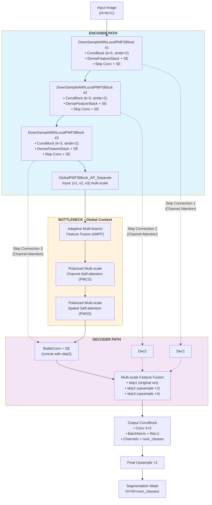

# LiSA-Net: A Lightweight Self-Attending Network for Melanoma Segmentation

By **Andre Dalwin Tan**, **Sharmaine Chua**, and **Trisha Angel Millena**

Department of Information Systems and Computer Science  
Ateneo de Manila University  
2025

## Overview

LiSA-Net (Lightweight Self-Attending Network) is a novel U-Net-based architecture designed specifically for accurate melanoma segmentation while maintaining a lightweight computational footprint. This model addresses the critical need for efficient medical image segmentation tools that can be deployed in resource-constrained environments without sacrificing accuracy.

The project builds upon the foundation of [PMFSNet: Polarized Multi-scale Feature Self-attention Network For Lightweight Medical Image Segmentation](https://github.com/yykzjh/PMFSNet), extending it with several key innovations:

- Integration of Squeeze-and-Excitation (SE) blocks in every convolution layer for enhanced feature recalibration
- Modified architecture specifically optimized for melanoma detection
- Improved attention mechanisms for better segmentation accuracy
- Maintained lightweight design suitable for deployment on mobile and edge devices

## Key Features

- **Lightweight Architecture**: Only 0.99M parameters and 2.63 GFLOPs
- **High Performance**: Achieves 80.09% IoU and 86.17% DSC on ISIC 2018 dataset
- **Robust to Limited Data**: Maintains competitive performance even with reduced training data
- **Self-Attention Enhanced**: Incorporates Polarized Multi-scale Feature Self-attention (PMFS) blocks
- **Channel Attention**: SE blocks in every convolution for adaptive feature recalibration

## Data Preparation

[ISIC 2018](https://pan.baidu.com/s/16vla-i12GSwjqTTGc0CXSA?pwd=qola):

```
./datasets/ISIC-2018/
	train/
		images/
			ISIC_0000000.jpg
			......
			ISIC_0016072.jpg
		annotations/
			ISIC_0000000_segmentation.png
			......
			ISIC_0016072_segmentation.png
	test/
		images/
			ISIC_0000003.jpg
			......
			ISIC_0016060.jpg
		annotations/
			ISIC_0000003_segmentation.png
			......
			ISIC_0016060_segmentation.png
```

## Architecture

### LiSA-Net Architecture Diagram



### Architecture Components

#### Core Modules

1. **LiSASEBlock**: Squeeze-and-Excitation blocks for channel-wise feature recalibration
   - Global Average Pooling → FC → ReLU → FC → Sigmoid
   - Applied in EVERY ConvBlock throughout the network
   
2. **LiSAConvBlock**: Enhanced convolution blocks with integrated SE attention
   - Structure: [BN] → ReLU → Pad → Conv → [SE Block]
   - Provides adaptive channel-wise feature recalibration

3. **LiSALocalPMFSBlock**: Local polarized multi-scale feature self-attention modules
   - Contains DenseFeatureStack with dense connections
   - Growth rates increase with depth: [4, 8, 16]
   - Each unit includes ConvBlock + SE

4. **LiSAGlobalPMFSBlock**: Global feature aggregation with multi-scale attention
   - Processes features from all encoder levels simultaneously
   - Implements both channel (PMCS) and spatial (PMSS) attention
   - Linear complexity vs quadratic in standard self-attention

### Key Design Features

- **Ultra-Lightweight**: Only 0.99M parameters and 2.63 GFLOPs
- **Multi-Scale Processing**: Leverages features from all encoder levels
- **Efficient Attention**: Linear complexity through polarized decomposition
- **SE-Enhanced**: Every convolution includes squeeze-and-excitation
- **Dense Connections**: Within encoder blocks for feature reuse

### Configuration (BASIC Version)

| Parameter | Values |
|-----------|--------|
| Base channels | [24, 48, 64] |
| Skip channels | [24, 48, 64] |
| Units | [5, 10, 10] |
| Growth rates | [4, 8, 16] |
| PMFS channels | 64 |

## Training

Running `train.py` script can easily start the training. Customize the training by passing in the following arguments:

```
--dataset: dataset name (ISIC-2018 for melanoma segmentation)
--model: model name (LiSANet or comparison models)
--pretrain_weight: pre-trained weight file path (optional)
--dimension: dimension of dataset images and models (2d for skin lesion images)
--scaling_version: scaling version (BASIC, SMALL, or TINY)
--epoch: training epoch
```

Training example for LiSA-Net:

```python
python ./train.py --dataset ISIC-2018 --model LiSANet --dimension 2d --scaling_version BASIC --epoch 150
```

## Testing

### Evaluating model performance on a test set

Running `test.py` script to start the evaluation. The input arguments are the same as the training script. Testing example:

```python
python ./test.py --dataset ISIC-2018 --model LiSANet --pretrain_weight ./pretrain/LiSANet-BASIC_ISIC2018.pth --dimension 2d --scaling_version BASIC
```

### Inferring a single image segmentation result

Running `inference.py` script to perform inference on a single image. The additional argument `--image_path` specifies the input image. Inferring example:

```python
python ./Model/inference.py --dataset ISIC-2018 --model LiSANet --pretrain_weight ./Model/pretrain/LiSANet-Base-K4.pth --dimension 2d --scaling_version BASIC --image_path ./Model/pretrain/ISIC_0000013.jpg
```

### Batch inference on multiple images

Running `batchinference.py` script to perform inference on multiple images in a directory. The additional argument `--images_dir` specifies the directory containing input images:

```python
python ./Model/batchinference.py --dataset ISIC-2018 --model LiSANet --pretrain_weight ./Model/pretrain/LiSANet-Base-K4.pth --dimension 2d --scaling_version BASIC --images_dir ./Model/inference/Test-1000-K1
```

**Note**: 
- Inference results are saved in the `Model/inferences/` directory
- Pre-trained weights are available in the `Model/pretrain/` directory for different dataset sizes and K-folds
- Test images for evaluation are located in `Model/inference/` organized by dataset size and K-fold

## Comparison Models

For melanoma segmentation on ISIC 2018 dataset, we evaluated LiSA-Net against the following state-of-the-art models:

- **[U-Net](https://link.springer.com/chapter/10.1007/978-3-319-24574-4_28)**: The foundational convolutional network for biomedical image segmentation
- **[AttU-Net](https://arxiv.org/pdf/1804.03999.pdf)**: U-Net enhanced with attention gates for improved feature localization
- **[CANet](https://ieeexplore.ieee.org/abstract/document/9246575)**: Comprehensive attention network with spatial, channel, and scale attention
- **[PMFSNet](https://github.com/yykzjh/PMFSNet)**: Lightweight model with polarized multi-scale feature self-attention (our baseline)

## Results

### Performance on ISIC 2018 Melanoma Dataset

Comprehensive evaluation results comparing LiSA-Net with state-of-the-art models on the ISIC 2018 melanoma segmentation dataset:

| Method                | FLOPs(G) | Params(M) | IoU(%) | DSC(%) | 
| --------------------- | :------: | :-------: | :----: | :----: |
| U-Net                 |  41.93   |   31.04   | 79.83  | 86.25  |
| AttU-Net              |  51.07   |   34.88   | 80.78  | 87.02  |
| CANet                 |   4.62   |   2.79    | 72.53  | 80.07  |
| PMFSNet               |   2.21   |   0.99    | 80.64  | 86.60  |
| **LiSA-Net (Ours)**   | **2.63** |  **0.99** |**80.09**|**86.17**|

### Key Achievements

1. **Ultra-Lightweight Architecture**: With only 0.99M parameters, LiSA-Net is 31x smaller than U-Net and 35x smaller than AttU-Net
2. **Computational Efficiency**: At 2.63 GFLOPs, LiSA-Net requires 94% less computation than AttU-Net
3. **Competitive Performance**: Achieves performance on par with much larger models while maintaining minimal resource requirements
4. **Robust to Limited Data**: Shows superior performance when training data is reduced (best IoU of 79.70% with only 1000 images)

### Performance Across Different Dataset Sizes

| Dataset Size | LiSA-Net IoU | LiSA-Net DSC | Best Competitor IoU | Best Competitor DSC |
| ------------ | :----------: | :----------: | :-----------------: | :-----------------: |
| Full (2594)  |    80.09%    |    86.17%    |   80.78% (AttU-Net) |   87.02% (AttU-Net) |
| 2000 images  |    77.60%    |    84.53%    |   80.22% (PMFSNet)  |   86.66% (PMFSNet)  |
| 1500 images  |    77.78%    |    84.96%    |   80.62% (AttU-Net) |   84.08% (AttU-Net) |
| 1000 images  |  **79.70%**  |  **86.33%**  |   77.77% (PMFSNet)  |   84.28% (PMFSNet)  |
| 500 images   |    75.34%    |    84.56%    |   75.76% (PMFSNet)  |   85.24% (AttU-Net) |

## Citation

If you use LiSA-Net in your research, please cite:

```bibtex
@thesis{lisanet2025,
  title={LiSA-Net: A Lightweight Self-Attending Network for Melanoma Segmentation},
  author={Tan, Andre Dalwin and Chua, Sharmaine and Millena, Trisha Angel},
  school={Ateneo de Manila University},
  year={2025},
  type={Bachelor's Thesis}
}
```

## Acknowledgments

This work builds upon PMFSNet and we thank the authors for their valuable contributions. We also acknowledge:
- Our thesis advisers Dr. Raphael Alampay and Dr. Patricia Abu
- Our panelists Dr. John Paul Vergara and Mr. Gabriel Lorenzo Santos
- Dr. Regina Justina Estuar and the ACCCRe for providing research facilities
- The Department of Information Systems and Computer Science, Ateneo de Manila University

## Requirements

- Python 3.8+
- PyTorch 1.10+
- CUDA 11.3+ (for GPU acceleration)
- See `requirements.txt` for complete list of dependencies

## Installation

```bash
# Clone the repository
git clone https://github.com/AndreDalwin/LiSA-Net.git
cd LiSA-Net

# Create virtual environment
python -m venv venv
source venv/bin/activate  # On Windows: venv\Scripts\activate

# Install dependencies
cd Model
pip install -r requirements.txt
```

## References

- [PMFSNet](https://github.com/yykzjh/PMFSNet) - Base architecture for lightweight medical segmentation
- [MONAI](https://github.com/Project-MONAI/MONAI/tree/dev) - Medical Open Network for AI
- [ISIC 2018 Challenge](https://challenge.isic-archive.com/data/#2018) - International Skin Imaging Collaboration dataset

## License

This project is licensed under the MIT License - see the LICENSE file for details.
